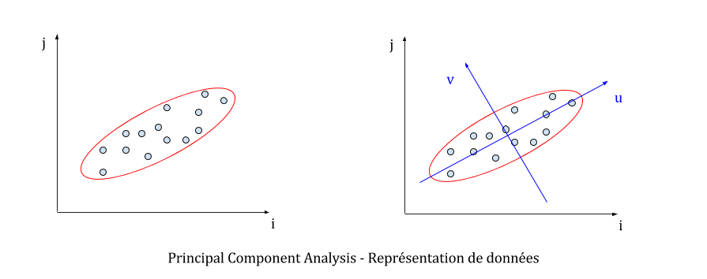
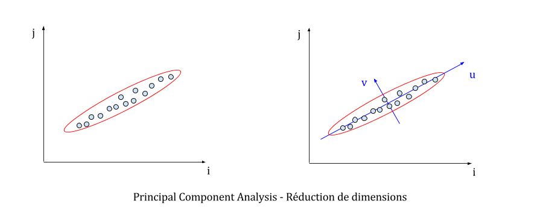
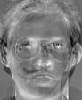
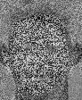
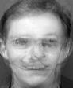

# Compression, reconstruction d'images et calculs au-delà de la troisième dimension

Ce billet présente l'algorithme PCA (pour Principal Component Analysis, ou encore analyse en composantes principales) qui est une technique mathématique pour identifier et expliquer la corrélation d'un ensemble de données discrètes. Cet article pose les bases de cet algorithme et détaille une de ses applications à la reconstruction d’image.

## Le PCA : une méthode, plein d'applications !

L'analyse en composantes principales est **une technique d'analyse et de visualisation de données qui est populaire dans un très grand nombre de domaines** qui n'ont, *a priori*, pas grand chose à voir entre eux. En effet, on retrouve l'algorithme PCA en économie, en biologie, mais aussi en physique, en mathématiques (évidemment), en apprentissage automatique (machine learning), sans oublier les sciences sociales ou encore la finance. Pour être bref, PCA est utilisé dans à peu près tous les domaines qui manipulent des données quantifiables et qui ont besoin de faire des statistiques pour trouver une structure, un modèle dans la donnée, afin d'être en mesure d'expliquer leur provenance et leurs fluctuations.

D'autre part, il s'agit d'**une technique qui est relativement simple à appréhender**, pourvu qu'on soit à l'aise avec certains fondamentaux mathématiques (notions de matrices, d'espaces vectoriels et de statistiques). C'est ce qui explique d’ailleurs pourquoi le PCA a été utilisé dans des domains si différents.

## Principal Component Analysis

L'analyse en composantes principales (PCA) est une technique statistique qui se charge d'expliciter la covariance d'un ensemble de données. La représentation de la donnée en amont est laissée à la discrétion de l'utilisateur, et nous reviendrons dessus dans un cas d'utilisation concret plus loin dans ce billet. En particulier, **le PCA permet de déterminer les axes** (*ie* les directions) **selon lesquels le jeu de données varie le plus**. Il s'agit d'une méthode qui permet d'éliminer la corrélation des données et de trouver une représentation moins redondante, plus compacte, de la même information.

**Les calculs mis en œuvre lors de l'application du PCA reposent essentiellement sur des notions d'algèbre linéaire**. Cet article se veut didactique et présente le principe via différents schémas, en laissant un peu de côté le détail des formules mathématiques. En pratique, cet algorithme est disponible dans de nombreuses librairies d'algèbre linéaire, pour un vaste panel de langages de programmation. Il n'est donc pas nécessaire de le réimplémenter pour construire de nouveaux algorithmes par dessus.

Dans un soucis de clarification (et surtout parce que l'esprit humain n'est pas vraiment habitué à se représenter les choses au-delà de trois dimensions), **la technique du PCA sera présentée dans un espace en deux dimensions**. Le jeu de données initial est donc un ensemble de points entièrement définis par leurs coordonnées dans un repère usuel `(i,j)`.

Il faut garder en tête que le PCA repose sur des calculs d'algèbre linéaire valables pour un nombre quelconque de dimensions (on parle aussi *d'algèbre linéaire en dimension finie*) et que **le PCA peut être utilisé sur des données représentées par autant de coordonnées que l'on veut**. En d'autres termes, on peut faire tourner cette méthode aussi bien sur des points en deux dimensions que sur des échantillons sanguins décrits par des centaines de paramètres différents (concentration d'un type d'enzyme, taux de plaquettes...). L'application de cette technique à la compression et à la reconstruction d'images manipule par exemple des *points* qui ont plus de 10 000 coordonnées différentes (le nombre de pixels dans chaque image), comme nous le verrons dans la prochaine section.

Intuitivement, la technique du PCA permet de **trouver un repère** (de l'espace dans lequel on travaille) **qui minimise le degré de corrélation des données**. Dans la figure suivante, cela revient à trouver le repère `(u,v)` centré sur le point moyen du jeu de données alors qu'on ne connaît que les points dans le repère initial `(i,j)`.

Le principe du PCA est plutôt simple, puisqu'**on travaille sur un objet en particulier : la matrice de covariance du jeu de données**. Cette matrice décrit le degré de corrélation de chaque coordonnée des points du jeu de données, c'est-à-dire que les coefficients de cette matrice sont des mesures représentant à quel point telle coordonnée est couplée à telle autre coordonnée pour les échantillons observés. La méthode usuelle pour construire la matrice de covariance consiste à créer une matrice qui a pour chaque ligne un point du jeu de données. On recentre le jeu de données autour de la moyenne, et on multiplie la transposée de la matrice par elle-même pour en déduire la matrice de covariance (à un facteur de normalisation près).

Des théorèmes mathématiques bien connus - dont un de mes favoris, le [théorème spectral](https://fr.wikipedia.org/wiki/Th%C3%A9or%C3%A8me_spectral) - garantissent que **cette matrice de covariance est diagonalisable**, qu'on peut via ses vecteurs propres en déduire une base orthonormale de l'espace, et qu'ils sont en plus dirigés dans les directions où les données varient le plus. Dans notre cas, il s'agit de la base `(u,v)`. **Ces vecteurs propres `u` et `v`**, puisqu'ils décrivent les directions dans lesquelles les données sont le plus dispersées, **sont appelés composantes principales**. Par ailleurs, il faut savoir qu'à chaque vecteur propre est associée une valeur propre (*eigenvector* et *eigenvalue* en anglais) et qu'un vecteur propre contribue d'autant plus à la variabilité des données que sa valeur propre associée est grande (relativement aux autres valeurs propres).

On est donc capable, en sortie de PCA, de connaître les principaux axes de dispersion des données, mais aussi de savoir quels axes décrivent le mieux cette dispersion. **Ces informations ouvrent la voie à des représentations plus compactes, et moins redondantes des données**. Souvent, les données observées disposent d'une structure cachée que le PCA fait ressortir. On se rend alors compte que les données peuvent être représentées différemment tout en conservant un degré de précision raisonnable. Par exemple, dans la figure suivante, on se rend compte qu'on a tout intérêt à représenter les données uniquement selon l'axe `u`, puisque l'axe `v` décrit très peu la dispersion du jeu de données.

Supposons que notre jeu de données compte `1000` points (de deux coordonnées chacun). Il faut donc `2000` valeurs dans le repère `(i,j)` pour décrire totalement le jeu de données. Après le PCA, il faut `1004` valeurs distinctes :
- `2` valeurs pour décaler l'origine du repère sur la moyenne des points ;
- `2` valeurs pour décrire l'axe `u` ;
- `1000` valeurs pour décrire les abscisses de chaque point sur l'axe `u`.

On a donc réduit de moitié l'espace nécessaire pour stocker les données. Le gain est d'autant plus intéressant si les données ont beaucoup des composantes principales qui ne contribuent pas à leur dispersion. Cette technique est souvent nommée "**réduction de complexité**" dans la littérature.

## Une application : compression et reconstruction d'images

La compression et la reconnaissance d'images forment un pan de l'apprentissage automatique (*machine learning*) dans lequel le **PCA est largement utilisé**, notamment **pour réduire le nombre de variables nécessaires à la représentation - et donc au stockage, en mémoire vive ou sur disque - d'une image**.

Avant d'aller plus loin, il est nécessaire de poser certains prérequis qui vont garantir que les pixels des images seront très corrélés. Par conséquent, le recours au PCA n'en sera que plus utile et les résultats seront plus faciles à appréhender visuellement. On pose donc les prérequis suivants :
- les images manipulées sont à la même résolution ;
- le contenu des images est relativement similaire d'une image à l'autre.

Afin de prendre en compte les suppositions précédentes, **nous travaillerons avec le trombinoscope ci-dessous**. Chaque image est à la résolution `92x128` et est en nuances de gris (pour chaque pixel, il y a une seule valeur sur `8` bits qui décrit la nuance de gris). Ce jeu d'images est disponible sur le web, il s'agit d'ailleurs d'un échantillon d'une base d'images bien plus importante utilisée dans un bon nombre d'articles de recherche.

En terme de représentation, chaque image est une matrice de taille `92x128`, qui contient des entiers entre 0 et 255 (les nuances de gris de chaque pixel). On peut aussi voir chaque image sous un autre angle : au lieu de la représenter par une matrice, on peut la modéliser par une seule ligne (en mettant toutes les lignes qui composent l'image bout à bout). Chaque point (ou *vecteur*, en algèbre linéaire ce sont les mêmes notions) obtenu a alors `92 x 128 = 11776` coordonnées. Nous allons donc lancer le PCA dans un espace à `11776` dimensions !

**On construit donc notre matrice représentant le jeu de données** en plaçant, pour chaque ligne, le point correspondant à chaque image. Cette matrice a donc une taille de `6x11776` (il y a `6` images en tout). On multiplie la transposée par elle-même, on normalise par le nombre d'images, et on obtient la fameuse matrice de covariance de taille `11776x11776` à diagonaliser ! On constate qu'on est déjà bien sorti du cadre de l'exemple avec les points en deux dimensions, et que ces calculs peuvent vite devenir coûteux. Heureusement, la grande majorité des librairies d'algèbre linéaire sont optimisées pour les calculs matriciels, via le recours à des *sparse matrices*, à certaines heuristiques de calculs ou encore en déportant le calcul sur GPU.

Une fois la diagonalisation terminée, le PCA nous retourne une liste de six vecteurs propres (car il y a six images distinctes dans le jeu de données) avec les valeurs propres associées. Ces vecteurs propres sont nécessairement de taille `11776 = 92 x 128`, la même taille que les images initiales. Et si on les imprimait, pour voir à quoi elles ressemblent ? Ci-dessous sont présentées les images par ordre décroissant de valeur propre.

Intéressant, n'est-ce pas ? **Ces images montrent les directions dans lesquelles les images initiales varient le plus**. Plusieurs caractéristiques sont remarquables :
- la dernière *image propre* contribue très peu à expliquer la donnée (elle est toute "bruitée") ;
- les autres images propres cristallisent plusieurs caractéristiques de l'image (la couleur du fond, la teinte du visage, l'importance des lunettes ou des rides).

Rien qu'avec ces images, le PCA permet de classer les images initiales par rapport à des images *de référence*. On peut alors représenter chaque image initiale dans le repère formé par les *images propres*, qui du coup se ramène à 6 coordonnées (contre 11776 initialement). Il est donc plus facile d'étudier la donnée car il y a bien moins de variables à considérer).

**La reconstruction de la troisième image du jeu de données est montrée ci-dessous**, en appliquant successivement chaque composante principale à la précédente image. Il y a 7 images en tout, parce qu'on part de l'*image moyenne* (calculée en faisant la moyenne des nuances de gris des images initiales) et en appliquant successivement chacune des 6 composantes principales.

La reconstruction fonctionne, donc les mathématiques ne mentent pas ! Plus sérieusement, on remarque que les deux dernières reconstructions n'apportent pas énormément de valeur à l'image. On peut donc encoder l'image avec seulement ses quatre principales composantes et conserver ses caractéristiques. Quel est **le gain en terme d'espace de stockage**, pour toutes les images, en ne gardant que les quatre principales composantes ? Sans PCA, on a besoin de `6 x 11776 = 70656` octets (valeurs de `8` bits).

Avec PCA, on a besoin de stocker `58904` octets :
- l'image moyenne et les 4 vecteurs propres, soit `11776 x (1 + 4) = 58880` octets ;
- pour chaque image, sa représentation dans le repère des vecteurs propres, soit `6 x 4` octets.

Ce qui réalise un taux de compression de `16,63%` sans pour autant perdre le contenu de l'image. La qualité est dégradée évidemment, mais cela a en pratique peu d'impact (en apprentissage automatique notamment) car **l'essence même de l'image est préservée**.

## En résumé

Nous avons vu que la matrice de covariance issue du jeu de données initial est diagonalisable. L'algorithme permet de récupérer une base de vecteurs propres de cette matrice de covariance ainsi que les valeurs propres associées. **Plus grande est la valeur propre, plus le vecteur propre correspondant décrit l'axe selon lequel les données sont le plus dispersées** (et par conséquent décrit mieux le jeu de données).

Dans ce billet, nous avons introduit les concepts sur lesquels repose le PCA. Cette procédure mathématique cherche à **dé-corréler les données pour en trouver les axes de variation prépondérants**. Comme nous l'avons vu, l'analyse en composantes principales est applicable *a priori* sur des données de provenances diverses. Elle permet d'en déceler la structure, d'expliquer la manière dont elles sont liées les unes avec les autres. Les applications de cette technique sont larges, et nous en avons détaillé une, axée sur la compression et la reconstruction d'un ensemble d'images.

C'est tout pour aujourd'hui !

[Alexandre Dumont](https://twitter.com/_dumontal)

## Références

- [Visualisation en 3D du PCA (en, html)](http://setosa.io/ev/principal-component-analysis/)
- [Analyse du bruit d'un jeu de données et décomposition par valeurs singulières (en, pdf)](https://www.cs.princeton.edu/picasso/mats/PCA-Tutorial-Intuition_jp.pdf)
- [Article détaillé sur Wikipedia (en, html)](https://en.wikipedia.org/wiki/Principal_component_analysis)
